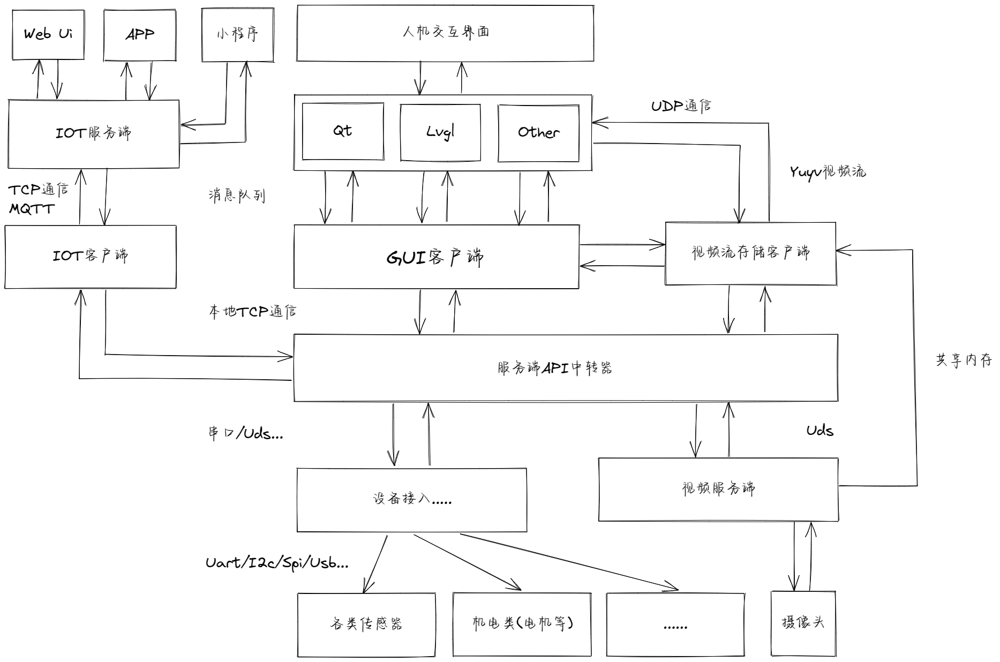

# Divine

#### 介绍
嵌入式应用项目通用解耦式框架实现

#### 软件架构

初步的想法是想做一套通用的解耦式应用软件框架，大概的设计蓝图如下所示：



#### 工程构建和运行
```
make clean
make -j8
./Divine
```

#### 参与贡献

- 1.Fork 本仓库
- 2.新建 Feat_xxx 分支
- 3.提交代码
- 4.新建 Pull Request
